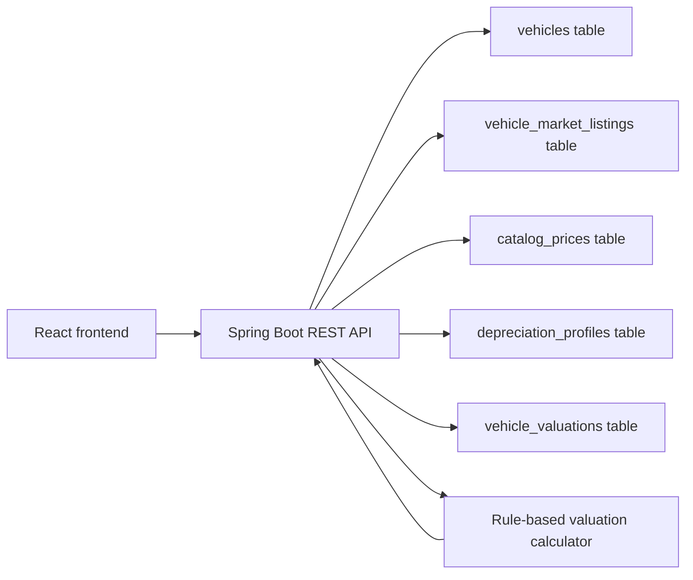
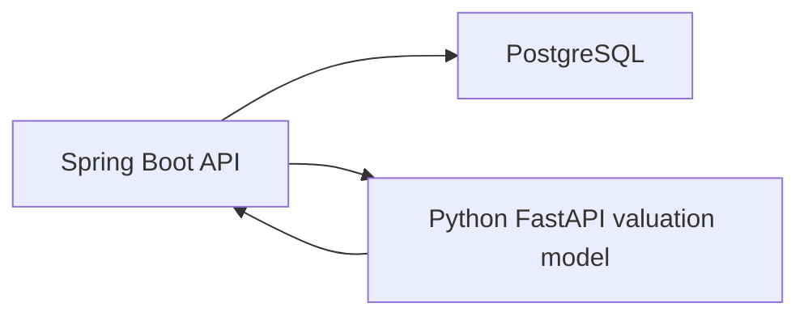

# Vehicle Market Value Estimation Software

## 1. Purpose And Scope

This project is a Bachelor MVP for estimating the current market value of used cars. It is not a Dealer Management System. The software focuses only on:

- storing vehicle data needed for valuation,
- storing comparable market listings,
- calculating a rule-based market value,
- exposing the result through REST APIs,
- showing the calculation in a simple React frontend.

The first version is intentionally explainable. It does not use machine learning yet.

## 2. System Overview

The system has three main parts:

- Backend: Java Spring Boot REST API.
- Database: PostgreSQL with Flyway migrations.
- Frontend: React + TypeScript visual tester.

High-level flow:

1. A vehicle is selected as the valuation target.
2. The backend finds similar market listings by brand, model, year range, and mileage range.
3. The backend calculates an average market price.
4. The backend applies simple market adjustments for mileage, age, condition, and accident history.
5. The backend looks up catalog price and depreciation profile data.
6. The backend calculates a catalog depreciation value and compares it with the live market value.
7. The valuation result is saved and returned to the frontend.
8. The frontend displays live market value, catalog value, market gap, dealer buy range, confidence, and comparable listings.



## 3. Technology Stack

| Layer | Technology |
|---|---|
| Backend | Java 21, Spring Boot 3 |
| API | Spring Web |
| Persistence | Spring Data JPA / Hibernate |
| Database | PostgreSQL |
| Migrations | Flyway |
| Frontend | React, TypeScript, Vite |
| Local database | Docker Compose PostgreSQL |
| Tests | JUnit 5 |

## 4. Backend Structure

Important backend files:

| File | Responsibility |
|---|---|
| `src/main/java/com/example/dealership/DealerManagementApplication.java` | Spring Boot application entry point. The class name comes from the first prototype name, but the product scope is vehicle valuation only. |
| `src/main/java/com/example/dealership/vehicle/Vehicle.java` | Valuation target vehicle entity. |
| `src/main/java/com/example/dealership/market/VehicleMarketListing.java` | Comparable market listing entity. |
| `src/main/java/com/example/dealership/market/MarketSnapshot.java` | Represents one market data collection/snapshot. |
| `src/main/java/com/example/dealership/catalog/CatalogPrice.java` | Original catalog/new price reference data. |
| `src/main/java/com/example/dealership/catalog/DepreciationProfile.java` | Rule-based depreciation settings per brand/model segment. |
| `src/main/java/com/example/dealership/valuation/VehicleValuation.java` | Saved valuation result entity. |
| `src/main/java/com/example/dealership/valuation/ValuationService.java` | Orchestrates vehicle lookup, similar listing lookup, calculation, and persistence. |
| `src/main/java/com/example/dealership/valuation/ValuationCalculator.java` | Contains the explainable rule-based calculation. |
| `src/main/java/com/example/dealership/valuation/ValuationController.java` | Valuation REST endpoints. |
| `src/main/java/com/example/dealership/market/MarketListingController.java` | Similar listing endpoint. |
| `src/main/java/com/example/dealership/vehicle/VehicleController.java` | Vehicle read endpoint for the frontend. |

## 5. Database Design

The MVP started with the four required valuation tables and now also includes two reference tables for catalog depreciation. These six tables support the first market-value MVP without turning the project into a full dealer management system.

### `vehicles`

Stores the vehicle for which a value should be calculated.

Important fields:

- `brand`
- `model`
- `version`
- `manufacture_year`
- `mileage`
- `fuel_type`
- `transmission`
- `power_kw`
- `vehicle_condition`
- `accident_history`
- `equipment`
- `location`
- `purchase_price`
- `listed_price`

### `vehicle_market_listings`

Stores market comparable vehicles from external market sources or seed data.

Important fields:

- `source`
- `brand`
- `model`
- `version`
- `manufacture_year`
- `mileage`
- `price`
- `location`
- `listing_date`
- `url`

### `market_snapshots`

Stores metadata about one market data collection event.

Important fields:

- `source`
- `brand`
- `model`
- `version`
- `search_url`
- `snapshot_date`
- `total_listings`
- `notes`

### `catalog_prices`

Stores original catalog/new prices used for the catalog-based value.

Important fields:

- `brand`
- `model`
- `version`
- `manufacture_year`
- `catalog_price`
- `currency`
- `source`

### `depreciation_profiles`

Stores explainable depreciation settings by brand/model or default segment.

Important fields:

- `brand`
- `model`
- `segment`
- `year_one_rate`
- `year_two_rate`
- `year_three_rate`
- `annual_rate_after_year_three`
- `mileage_rate_per_km`
- `manufacturer_retention_factor`

### `vehicle_valuations`

Stores calculated valuation results.

Important fields:

- `vehicle_id`
- `valuation_date`
- `average_market_price`
- `estimated_market_value`
- `catalog_price`
- `catalog_depreciation_value`
- `market_catalog_gap`
- `dealer_purchase_price_min`
- `dealer_purchase_price_max`
- `trade_in_value`
- `recommended_selling_price`
- `confidence_score`
- `similar_listings_count`
- `mileage_adjustment`
- `age_adjustment`
- `condition_adjustment`
- `accident_adjustment`
- `explanation`

## 6. REST API

### List valuation input vehicles

```http
GET /api/vehicles
```

Returns all vehicles that can be valued.

### Get one valuation input vehicle

```http
GET /api/vehicles/{vehicleId}
```

Returns one vehicle.

### Calculate valuation

```http
POST /api/valuations/calculate
```

Request body:

```json
{
  "vehicleId": 1,
  "yearRange": 2,
  "mileageRange": 30000
}
```

Response example:

```json
{
  "vehicleId": 1,
  "averageMarketPrice": 75900,
  "estimatedMarketValue": 75900,
  "catalogPrice": 119900,
  "catalogDepreciationValue": 70500,
  "marketCatalogGap": 5400,
  "dealerPurchasePriceMin": 71900,
  "dealerPurchasePriceMax": 72900,
  "tradeInValue": 66800,
  "recommendedSellingPrice": 75900,
  "confidenceScore": 0.8,
  "similarListingsCount": 17,
  "explanation": "Based on 17 similar listings..."
}
```

### Get latest valuation

```http
GET /api/valuations/{vehicleId}
```

Returns the latest stored valuation for a vehicle.

### Get similar market listings

```http
GET /api/market-listings/similar/{vehicleId}
```

Returns comparable listings used to visually explain the valuation.

## 7. Valuation Algorithm

The MVP uses a transparent rule-based algorithm.

### Similar listing search

The backend searches market listings where:

- brand matches the target vehicle,
- model matches the target vehicle,
- listing year is within `vehicleYear +/- yearRange`,
- listing mileage is within `vehicleMileage +/- mileageRange`.

The current default ranges are:

- `yearRange = 2`
- `mileageRange = 30000`

### Calculation steps

1. Calculate average asking price from similar listings.
2. Calculate average mileage of similar listings.
3. Calculate average year of similar listings.
4. Apply mileage adjustment.
5. Apply age adjustment.
6. Apply condition adjustment.
7. Apply accident-history adjustment.
8. Round results to the nearest CHF 100.
9. Calculate catalog depreciation value from catalog price, depreciation profile, mileage, condition, and accident history.
10. Calculate market/catalog gap.
11. Calculate dealer purchase range at CHF 3,000-4,000 below the market value.
12. Calculate confidence score.

### Adjustment rules

Mileage:

```text
mileageAdjustment = (averageComparableMileage - vehicleMileage) * 0.08 CHF
```

Age:

```text
ageAdjustment = (vehicleYear - averageComparableYear) * 1200 CHF
```

Condition:

| Condition | Adjustment |
|---|---:|
| Excellent | +5% |
| Good | 0% |
| Fair | -7% |
| Poor | -15% |

Accident history:

| Accident history | Adjustment |
|---|---:|
| None | 0% |
| Minor repaired | -5% |
| Major / yes | -12% |
| Unknown | -3% |

Output values:

```text
estimatedMarketValue = adjusted live market value
catalogDepreciationValue = catalogPrice * ageRetention * mileageRetention * manufacturerRetention * conditionRetention * accidentRetention
marketCatalogGap = estimatedMarketValue - catalogDepreciationValue
dealerPurchasePriceMin = estimatedMarketValue - 4000
dealerPurchasePriceMax = estimatedMarketValue - 3000
tradeInValue = estimatedMarketValue * 0.88
recommendedSellingPrice = estimatedMarketValue
```

### Confidence score

The confidence score is based on:

- number of similar listings,
- price variance between those listings.

More comparable listings and lower price spread produce a higher confidence score.

## 8. Frontend

The frontend is a visual tester for the valuation API.

Important files:

| File | Responsibility |
|---|---|
| `frontend/src/App.tsx` | Main UI, API calls, state management. |
| `frontend/src/styles.css` | Layout and styling. |
| `frontend/vite.config.ts` | Vite config and `/api` proxy to Spring Boot. |

Frontend features:

- select a vehicle,
- view vehicle details,
- configure year and mileage ranges,
- calculate valuation,
- view live market value, catalog value, market gap, dealer buy range, selling price, trade-in reference, and confidence,
- view similar market listings.

## 9. Local Setup

Start PostgreSQL:

```bash
docker compose up -d postgres
```

Start backend:

```bash
mvn spring-boot:run
```

Start frontend:

```bash
cd frontend
npm install
npm run dev
```

Open:

```text
http://127.0.0.1:5173/
```

Backend:

```text
http://localhost:8080
```

## 10. Seed Data

The Flyway migrations insert:

- sample target vehicles,
- 50 realistic used car market listings,
- many BMW M4 comparables for testing.
- catalog prices and depreciation profiles for the first supported performance-car examples.

This allows the MVP to run without live market scraping.

## 11. Market Data Ingestion

The valuation quality depends on comparable market data. In a real deployment, market listings can come from:

- approved/licensed marketplace data access,
- manually imported CSV files,
- browser-saved HTML parsed by the existing Python scraper,
- other permitted vehicle data sources.

The system should store market listings as snapshots so values can be recalculated over time and market movement can be analyzed.

Important compliance note: the software should not bypass marketplace bot protection, CAPTCHA, or access restrictions.

## 12. Testing

Backend tests:

```bash
mvn test
```

Frontend build check:

```bash
cd frontend
npm run build
```

The current unit tests focus on `ValuationCalculator`, because that is the most important business logic for the MVP.

## 13. Future Python Machine Learning Integration

The rule-based Java calculator can later be replaced or supported by a Python model.

Recommended architecture:



Spring Boot should remain responsible for:

- REST APIs,
- database access,
- vehicle records,
- market listing records,
- stored valuation results.

Python should be responsible only for:

- feature engineering,
- model inference,
- returning predicted market value and confidence.

The API response should stay the same so the React frontend does not need to change.

Possible migration path:

1. Keep the current Java rule-based calculator.
2. Export historical listings and valuations to Python.
3. Train a regression model.
4. Expose the model through FastAPI.
5. Let Spring Boot call the Python service.
6. Keep the Java calculator as fallback if the ML service is unavailable.

## 14. MVP Limitations

- Seed data is realistic but not live market data.
- Asking prices are not final sale prices.
- Equipment is currently stored as text, not normalized features.
- Similarity matching is simple: brand, model, year, mileage.
- No authentication or user management.
- No machine learning yet.
- No automated live scraping pipeline is active by default.

These limitations are acceptable for a Bachelor MVP because the calculation is transparent and easy to explain.
